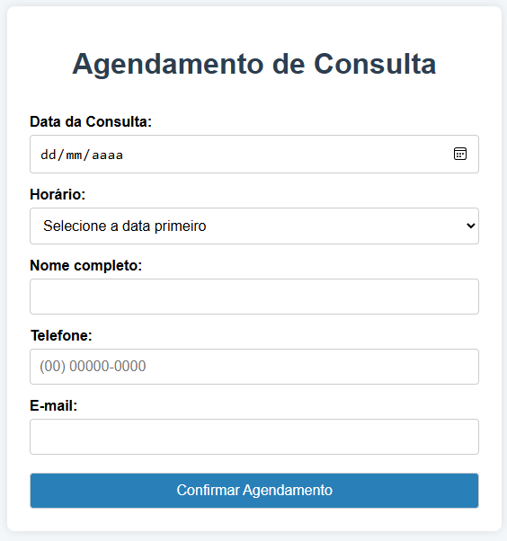
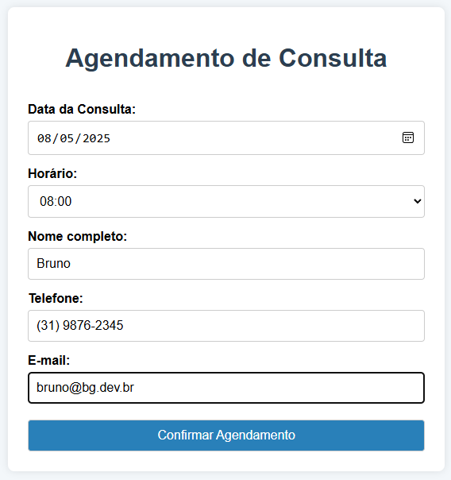
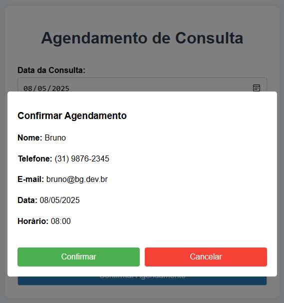

# Sistema de Agendamento de Consultas

Este é um sistema web simples e responsivo para agendamento de consultas, desenvolvido com HTML, CSS e JavaScript puro.

  
  
  
  

## Funcionalidades

- **Formulário de Agendamento**
  - Data da consulta
  - Horários disponíveis
  - Nome completo
  - Telefone (com máscara automática)
  - E-mail

- **Validações**
  - Nome: mínimo 3 caracteres, apenas letras
  - Telefone: formato (00) 00000-0000
  - E-mail: formato válido
  - Data e horário: obrigatórios

- **Processo de Agendamento**
  1. Preenchimento do formulário
  2. Validação dos dados
  3. Modal de confirmação
  4. Confirmação ou cancelamento do agendamento
  5. Exibição do resumo (se confirmado)
  6. Opção de novo agendamento

## Tecnologias Utilizadas

- HTML5
- CSS3
- JavaScript (Vanilla)
- Design Responsivo

## Responsividade

O sistema é totalmente responsivo e se adapta a diferentes tamanhos de tela:
- Desktop (≥ 1024px)
- Tablet (768px - 1024px)
- Smartphone (≤ 768px)
- Smartphone pequeno (≤ 480px)

## Interface

- Design moderno e limpo
- Cores suaves e agradáveis
- Feedback visual nas interações
- Modal de confirmação
- Mensagens de erro claras

## Pré-requisitos

Para executar o projeto, você precisa apenas de um navegador web moderno.

## Como Executar

1. Clone este repositório
2. Abra o arquivo `index.html` em seu navegador
3. Pronto! O sistema está funcionando

## Funcionalidades Detalhadas

### Validação de Campos
- **Nome**: Aceita apenas letras e espaços, mínimo 3 caracteres
- **Telefone**: Formato brasileiro com DDD
- **E-mail**: Validação de formato padrão
- **Data**: Seleção através de calendário
- **Horário**: Lista de horários disponíveis

### Processo de Agendamento
1. Usuário preenche o formulário
2. Sistema valida todos os campos
3. Modal de confirmação exibe os dados
4. Usuário pode confirmar ou cancelar
5. Se confirmado:
   - Formulário é ocultado
   - Resumo é exibido
   - Botão "Novo Agendamento" aparece
6. Se cancelado:
   - Modal fecha
   - Dados permanecem no formulário

## Licença

Este projeto está sob a licença MIT. Veja o arquivo [LICENSE](LICENSE) para mais detalhes.

## Autor
Bruno Guimarães - [GitHub](https://github.com/bruno-bg)

## Atividade Acadêmica

Este projeto foi desenvolvido como parte da disciplina de Projeto Integrado Síntese - Ads do curso de Desenvolvimento Web da Anhanguera.
