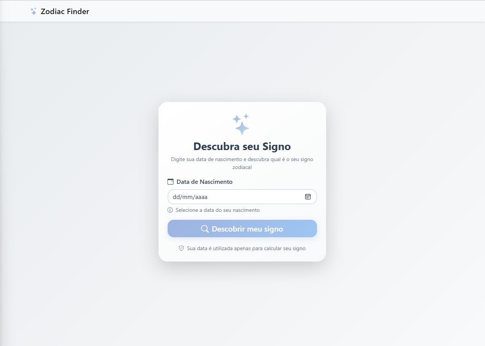
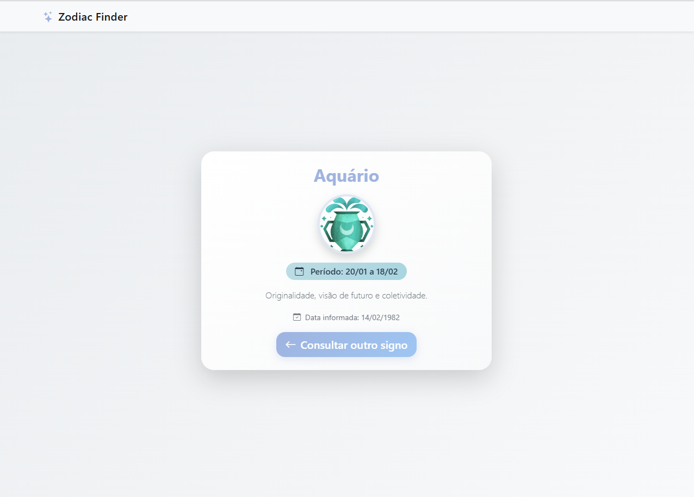

# Descobrir Signo 
♈♉♊♋♌♍♎♏♐♑♒♓

Sistema web para consulta de signos zodiacais baseado na data de nascimento.

<div style="display: flex; justify-content: space-between; flex-wrap: wrap;">
  
  
</div>


## 🚀 Funcionalidades

- ✅ **Formulário intuitivo** para inserção de data de nascimento
- ✅ **Cálculo automático** do signo zodiacal correspondente
- ✅ **Exibição visual** com imagem e características do signo
- ✅ **Interface responsiva** para todos os dispositivos
- ✅ **Validações robustas** no frontend e backend
- ✅ **Design moderno** com tema escuro e gradientes

## 🛠️ Tecnologias

- **Backend**: PHP 7.4+, XML, DateTime
- **Frontend**: HTML5, CSS3, JavaScript ES6+
- **Framework**: Bootstrap 5.2.0
- **Ícones**: Bootstrap Icons

## 📱 Como usar

1. Acesse a página principal
2. Digite sua data de nascimento
3. Clique em "Descobrir meu signo"
4. Veja o resultado com imagem e características

## 📁 Estrutura

```
descobrir-signo/
├── assets/          # CSS, JS e imagens
├── layouts/         # Componentes compartilhados
├── index.php        # Página principal
├── show_zodiac_sign.php  # Página de resultado
└── signos.xml       # Base de dados dos signos
```

## 🔧 Instalação

1. Clone o projeto
2. Coloque na pasta do seu servidor web
3. Acesse via navegador


## 🌟 Características

- **12 signos zodiacais** com datas precisas
- **Tratamento especial** para signos que cruzam anos
- **Validações avançadas** de entrada
- **Segurança** contra ataques XSS
- **Responsividade** completa
- **Animações** suaves e modernas

---

## Licença

Este projeto está sob a licença MIT. Veja o arquivo [LICENSE](LICENSE) para mais detalhes.

## Autor
Bruno Guimarães - [GitHub](https://github.com/bruno-bg)


## Atividade Acadêmica

Este projeto foi desenvolvido como parte da disciplina de Programação Web do curso de Desenvolvimento Web da Anhanguera.
