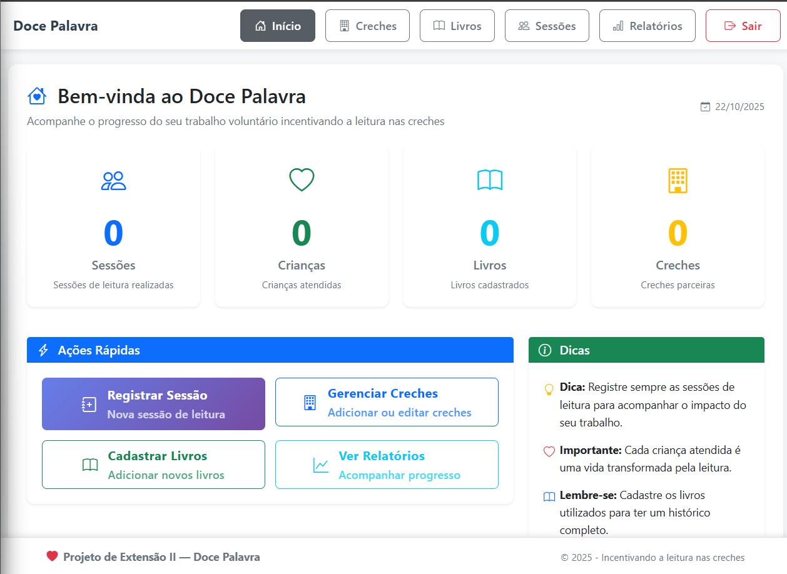
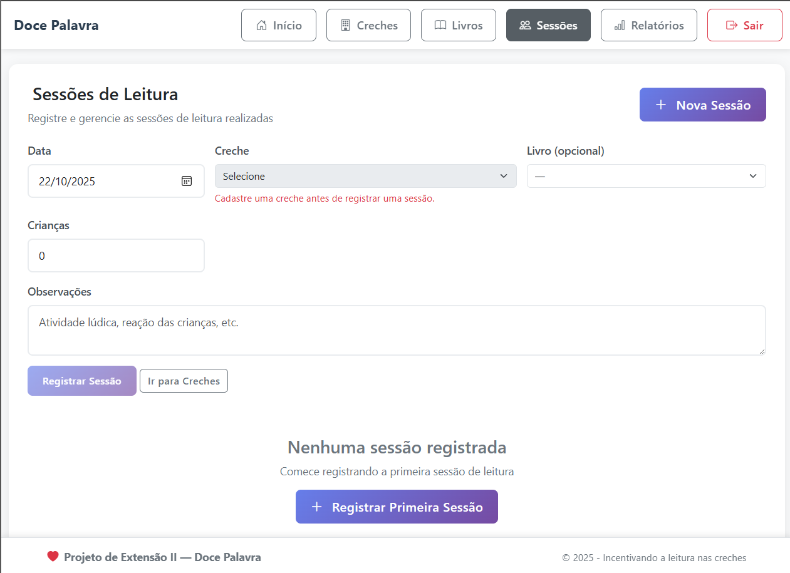

# 📚 Doce Palavra - Sistema de Gestão de Sessões de Leitura

<div style="display: flex; justify-content: space-between; flex-wrap: wrap;">


</div>

## 🎓 Projeto Acadêmico
**Disciplina:** Projeto de Extensão II  
**Instituição:** Faculdade Anhanguera  
**Objetivo:** Sistema para grupo de mulheres voluntárias (60+ anos) que realizam trabalho de incentivo à leitura em creches

## 🎯 Sobre o Projeto
O **Doce Palavra** é um sistema web desenvolvido especificamente para um grupo de mulheres voluntárias que realizam sessões de leitura em creches. O sistema foi projetado com foco em **acessibilidade** e **facilidade de uso**, considerando que o público-alvo possui mais de 60 anos e não possui muito conhecimento técnico.

### 👥 Público-Alvo
- Mulheres voluntárias com 60+ anos
- Trabalho voluntário em creches
- Incentivo e despertar do gosto pela leitura
- Necessidade de interface simples e intuitiva

## 🚀 Funcionalidades Implementadas

### 🏢 **Gestão de Creches**
- ✅ Cadastro de creches com informações completas
- ✅ Edição de dados das creches
- ✅ Exclusão segura (com verificação de sessões vinculadas)
- ✅ Listagem organizada com interface intuitiva

### 📚 **Gestão de Livros**
- ✅ Cadastro de livros do acervo
- ✅ Edição de informações dos livros
- ✅ Exclusão segura (com verificação de sessões vinculadas)
- ✅ Controle de quantidade de exemplares

### 📖 **Gestão de Sessões de Leitura**
- ✅ Registro de sessões de leitura realizadas
- ✅ Edição de sessões existentes
- ✅ Exclusão de sessões
- ✅ Vinculação com creches e livros

### 📊 **Relatórios e Estatísticas**
- ✅ Dashboard com estatísticas gerais
- ✅ Sessões por mês (últimos 6 meses)
- ✅ Livros mais utilizados
- ✅ Atividade por creche
- ✅ Relatórios visuais e acessíveis

## 🛡️ Recursos de Segurança

### 🔒 **Proteção de Dados**
- ✅ Verificação de relacionamentos antes de excluir
- ✅ Exclusão em cascata (opcional e segura)
- ✅ Confirmações duplas para operações perigosas
- ✅ Validação server-side e client-side

### 🎨 **Acessibilidade**
- ✅ Interface com botões grandes e legíveis
- ✅ Navegação por teclado
- ✅ Contraste adequado
- ✅ Fontes maiores para melhor leitura
- ✅ Tooltips informativos

## 🎨 Interface e Experiência do Usuário

### 💫 **Design Responsivo**
- ✅ Layout adaptável para diferentes telas
- ✅ Menu fixo superior e rodapé fixo
- ✅ Animações suaves com SweetAlert2
- ✅ Feedback visual claro para todas as operações

### 🔔 **Notificações Inteligentes**
- ✅ SweetAlert2 para confirmações
- ✅ Mensagens de sucesso e erro
- ✅ Alertas informativos sobre relacionamentos
- ✅ Confirmações duplas para exclusões

## 🛠️ Tecnologias Utilizadas

### **Backend**
- **PHP 8.0+** - Linguagem de programação
- **MySQL 8.0+** - Banco de dados
- **PDO** - Camada de abstração de banco
- **Sessions** - Gerenciamento de autenticação

### **Frontend**
- **HTML5** - Estrutura semântica
- **CSS3** - Estilos responsivos e acessíveis
- **JavaScript ES6+** - Interatividade
- **Bootstrap 5.3.3** - Framework CSS
- **Bootstrap Icons 1.11.3** - Ícones
- **SweetAlert2** - Notificações e confirmações

### **Ferramentas de Desenvolvimento**
- **XAMPP** - Ambiente de desenvolvimento
- **Apache** - Servidor web
- **MySQL Workbench** - Gerenciamento de banco

## 📋 Requisitos do Sistema

### **Servidor**
- PHP 8.0 ou superior
- MySQL 8.0 ou superior
- Apache 2.4 ou superior
- Extensão PDO habilitada
- XAMPP/Laragon (recomendado)

### **Navegador**
- Chrome, Firefox, Safari ou Edge
- JavaScript habilitado
- Resolução mínima: 1024x768

## 🚀 Instalação e Configuração

### **1. Preparação do Ambiente**
```bash
# Clone ou baixe o projeto
# Coloque em: C:\xampp\htdocs\doce-palavra\
```

### **2. Configuração do Banco de Dados**
```sql
-- Execute o arquivo database/setup.sql no MySQL
-- Isso criará o banco 'doce_palavra' com todas as tabelas
```

### **3. Configuração da Aplicação**
```php
// Edite src/config/config.php com suas credenciais do MySQL
$host = 'localhost';
$dbname = 'doce_palavra';
$username = 'root';
$password = '';
```

### **4. Acesso ao Sistema**
```
URL: http://localhost/Anhanguera/desenvolvimento-web/doce-palavra/public/login.php
E-mail: admin@docepalavra.org
Senha: Admin@123
```

## 🎯 Funcionalidades por Módulo

### **Dashboard**
- Estatísticas gerais do sistema
- Cards informativos com ícones
- Acesso rápido às principais funcionalidades
- Dicas e orientações para o usuário

### **Creches**
- Cadastro completo (nome, bairro, contato, observações)
- Edição de dados existentes
- Exclusão segura com verificação de relacionamentos
- Listagem organizada com busca visual

### **Livros**
- Cadastro de acervo (título, autor, categoria, quantidade)
- Edição de informações
- Exclusão segura com verificação de sessões
- Controle de exemplares disponíveis

### **Sessões de Leitura**
- Registro de sessões realizadas
- Vinculação com creches e livros
- Controle de público (número de crianças)
- Observações detalhadas sobre cada sessão

### **Relatórios**
- Estatísticas por período
- Sessões por mês
- Livros mais utilizados
- Atividade por creche
- Dados exportáveis

## 🔧 Recursos Técnicos Avançados

### **Proteção de Integridade**
- Verificação de foreign keys antes de exclusões
- Opção de exclusão em cascata (controlada)
- Logs de operações críticas
- Validação de dados em múltiplas camadas

### **Experiência do Usuário**
- Interface adaptada para usuários 60+
- Botões grandes e legíveis
- Navegação intuitiva
- Feedback visual imediato
- Confirmações claras

### **Acessibilidade**
- Navegação por teclado
- Contraste adequado
- Fontes maiores
- Tooltips informativos
- Skip links para leitores de tela

## 📊 Banco de Dados

### **Tabelas Principais**
- `users` - Usuários do sistema
- `roles` - Perfis de acesso
- `creches` - Instituições parceiras
- `books` - Acervo de livros
- `reading_sessions` - Sessões realizadas
- `session_participants` - Participantes das sessões

### **Relacionamentos**
- Sessões vinculadas a creches e livros
- Usuários com perfis específicos
- Integridade referencial garantida

## 🎓 Contribuição Acadêmica

Este projeto foi desenvolvido como parte do **Projeto de Extensão II** da Faculdade Anhanguera, demonstrando:

- **Aplicação prática** de conceitos de desenvolvimento web
- **Foco em acessibilidade** e inclusão digital
- **Solução real** para problema social (incentivo à leitura)
- **Tecnologias modernas** com interface amigável
- **Arquitetura robusta** com segurança de dados

## 🏆 Conclusão

O **Doce Palavra** representa uma solução completa e acessível para gestão de sessões de leitura, desenvolvida com foco no usuário final e na importância social do incentivo à leitura nas creches. O sistema demonstra como a tecnologia pode ser uma aliada na inclusão digital e no apoio ao trabalho voluntário.

## Licença

Este projeto está sob a licença MIT. Veja o arquivo [LICENSE](https://github.com/bruno-bg/faculdade/tree/main/desenvolvimento-web/doce-palavra/LICENSE) para mais detalhes.

## Autor

Bruno Guimarães - [GitHub](https://github.com/bruno-bg)