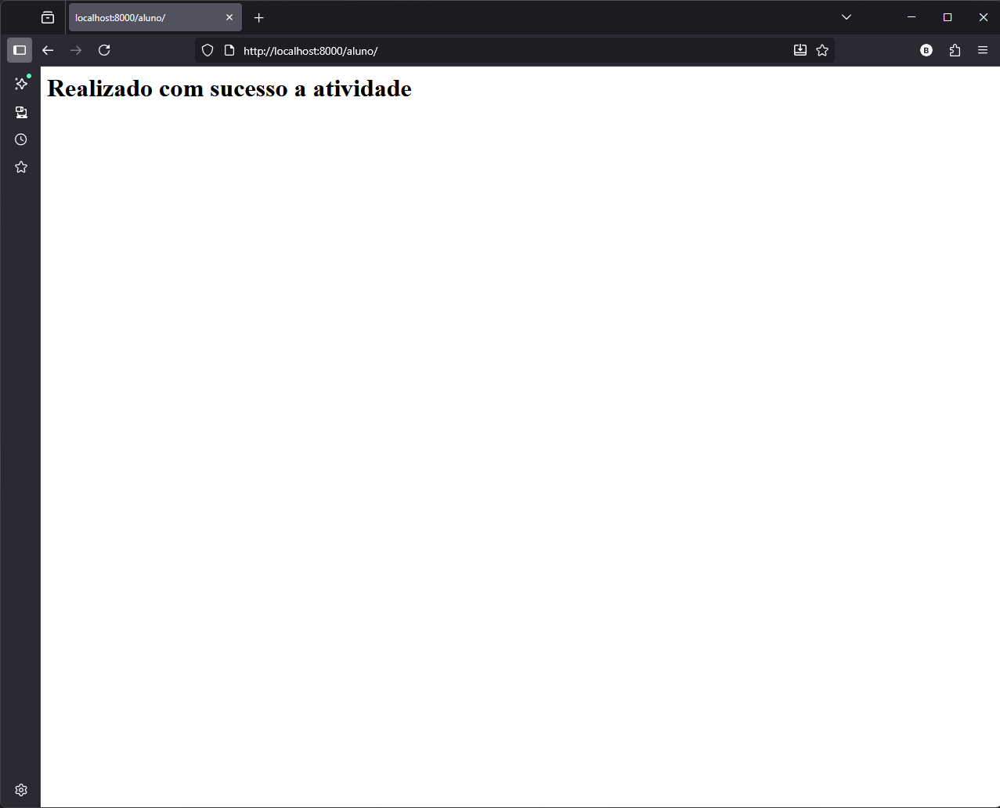

# Projeto Django - "projeto_todo"

Este projeto foi desenvolvido como parte da atividade prática da disciplina **Tecnologias Web Service**, com o objetivo de criar um projeto simples em **Django** que exibe a mensagem:

<div style="display: flex; justify-content: space-between; flex-wrap: wrap;">
  
  
  
</div>

##

> **"Realizado com sucesso a atividade"**

ao acessar o endereço `http://localhost:8000/aluno/`.

---

## Objetivo

Demonstrar o funcionamento básico de um **projeto Django**, incluindo:

- Criação do projeto;
- Criação de uma *view* e uma *URL*;
- Exibição de uma mensagem via navegador.

---

## Requisitos

- **Python 3.10+**
- **Django 5.x**
- **Pip** instalado
- **Ambiente virtual (venv)** configurado

---

## Estrutura do Projeto

```
projeto_todo/
├── manage.py
├── projeto_todo/
│   ├── __init__.py
│   ├── asgi.py
│   ├── settings.py
│   ├── urls.py
│   ├── views.py
│   └── wsgi.py
└── venv/  (opcional, criado localmente)
```

---

##  Passo a Passo para Execução

### 1️ - Clonar ou extrair o projeto
Baixe o arquivo `.zip` e extraia-o em um diretório de sua preferência.  
Exemplo:
```
D:\Documentos\projeto_todo
```

### 2️ - Acessar o diretório do projeto
Abra o **Prompt de Comando** ou **Terminal** e digite:
```bash
cd "D:\Documentos\projeto_todo"
```

### 3️ - Criar e ativar o ambiente virtual
```bash
python -m venv venv
venv\Scripts\activate  # Windows
# ou
source venv/bin/activate  # Linux/Mac
```

### 4️ - Instalar o Django
```bash
pip install django
```

### 5️ - Rodar o servidor local
```bash
python manage.py runserver
```

---

## Acesso no Navegador

Após rodar o servidor, abra o navegador e acesse:

👉 **http://localhost:8000/aluno/**

Você verá a mensagem:

> **Realizado com sucesso a atividade**

---

## Principais Arquivos

### `views.py`
```python
from django.http import HttpResponse

def aluno(request):
    return HttpResponse("<h1>Realizado com sucesso a atividade</h1>")
```

### `urls.py`
```python
from django.contrib import admin
from django.urls import path
from . import views

urlpatterns = [
    path('admin/', admin.site.urls),
    path('aluno/', views.aluno),
]
```

---

## Tecnologias Utilizadas

- **Python**   
- **Django Framework**   
- **HTTP / HTML**   

---

## Observações

- O servidor padrão do Django roda por padrão na porta **8000**.  
  Caso queira alterar, use:
  ```bash
  python manage.py runserver 8080
  ```
  (Isso executará em `http://localhost:8080/aluno/`)

- Se receber erro de “No such file or directory”, verifique se está no diretório correto onde o arquivo `manage.py` se encontra.

---

## Licença

Este projeto está sob a licença MIT. Veja o arquivo [LICENSE](LICENSE) para mais detalhes.

## Autor
Bruno Guimarães - [GitHub](https://github.com/bruno-bg)


## Atividade Acadêmica

Este projeto foi desenvolvido como parte da disciplina *Tecnologias Web Service* do curso de Desenvolvimento Web da Anhanguera.